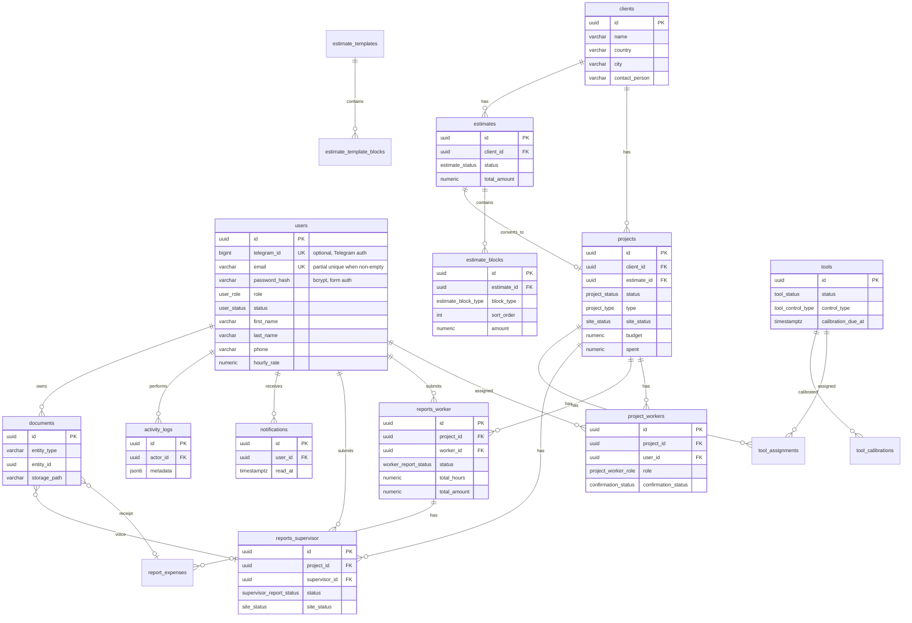

# ER Diagram — Mini CRM

## Overview

PostgreSQL schema for the Mini CRM Telegram Mini App. Money fields use `NUMERIC(15,2)`.

**Authentication:** users can sign in via **Telegram** (`telegram_id`) or **email + password** (`email`, `password_hash`). A single account may have both identifiers linked. Telegram-only users may have an empty `email`; form-login users require a unique non-empty `email`.

## Entity Relationship Diagram

## Tables (17)

| Table | Description |
|-------|-------------|
| `users` | Managers, workers, supervisors (Telegram and/or email credentials) |
| `clients` | Customer companies |
| `estimates` | Cost estimates |
| `estimate_blocks` | Service/resource/expense lines |
| `estimate_templates` | Reusable estimate templates |
| `estimate_template_blocks` | Template line items |
| `projects` | Active work sites |
| `project_workers` | Worker/supervisor assignments |
| `reports_worker` | Weekly worker reports |
| `report_expenses` | Expenses in worker reports |
| `reports_supervisor` | Daily supervisor reports |
| `tools` | Equipment inventory |
| `tool_assignments` | Tool checkout per project |
| `tool_calibrations` | Calibration history |
| `documents` | Uploaded files (polymorphic) |
| `notifications` | In-app + Telegram notifications |
| `activity_logs` | Audit / activity feed |

## Migration files

| File | Content |
|------|---------|
| `000001_users_clients` | users, clients |
| `000002_estimates` | estimates, blocks, templates |
| `000003_projects` | projects, project_workers |
| `000004_reports` | worker/supervisor reports, expenses |
| `000005_tools` | tools, assignments, calibrations |
| `000006_documents_notifications` | documents, notifications, activity_logs |
| `000007_auth_credentials` | `password_hash`, unique email index for form login |

## Auth fields (`users`)

| Column | Type | Notes |
|--------|------|-------|
| `telegram_id` | `BIGINT` UNIQUE | Optional; set on Telegram Mini App login |
| `email` | `VARCHAR(255)` | Unique when non-empty; used for form login |
| `password_hash` | `VARCHAR(255)` | bcrypt hash; empty for Telegram-only accounts |
